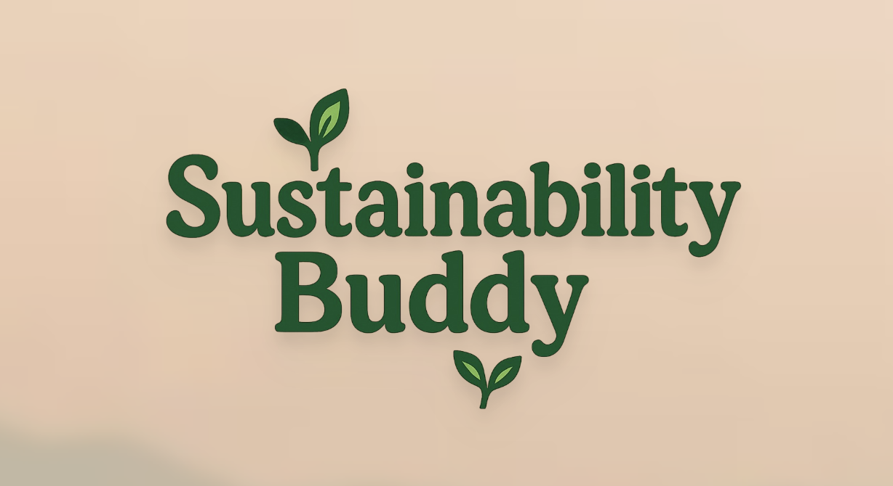

# Sustainability Buddy
*Created by Halo Kwok, Lara Dincer, and Kate Rampel for the 2025 Duke AI Hackathon.*

## Contributions
**Halo** — Built the full-stack application end-to-end (frontend and backend), including the agentic AI backend integration with Duke's LiteLLM gateway for personalized sustainability coaching, and finalized the design implementation.

**Kate** — Solidified the project concept and drove project direction through meeting organization.

**Lara** — Researched design philosophy and contributed to web development tooling.

[Pitch deck](https://www.figma.com/make/0zxwjQzbBwVvR2Og9Lz5Zf/Sustainability-Buddy-Pitch-Deck?node-id=0-4&t=26https://www.figma.com/community/file/1662925352579508427/sustainability-buddy-pitch-deck)
and 
[website](https://sustainabilitybuddy.netlify.app/)
linked here.

## Transform daily choices into measurable impact

## Vision
Sustainability Buddy is a personalized climate empowerment app that connects **education, daily habits, and community participation** into one seamless experience.  
It helps users understand the environmental challenges facing their region, shows how their individual actions contribute to collective impact, and connects them directly to local opportunities for sustainable living.

---

## Big Picture Goals
1. **Educate:** Explain local climate vulnerabilities (droughts, floods, heatwaves, etc.) based on user location, making sustainability relevant and personal.  
2. **Empower:** Provide personalized, actionable tips and track measurable impact over time.  
3. **Connect:** Aggregate local sustainability events and organizations to foster real-world engagement.  
4. **Enable:** Offer the most sustainable routes for users traveling to events or daily destinations.  
5. **Inspire:** Reduce eco-anxiety by showing clearly how individual and collective actions make a difference.

---

## Core Components

### 1. Personalized Educational Insights
- Uses geolocation and environmental datasets to identify local climate risks.  
- Provides short explainers on the causes, effects, and human significance of each issue.  
- Links education directly to action-oriented suggestions.  
  - *Example:* “Your region faces recurring droughts. Here’s why it matters — and how switching to drought-tolerant plants can help conserve water locally.”

---

### 2. Community Impact & Learning Dashboard
- Displays real-time metrics on each user’s saved emissions, water, energy, and waste reduction.  
- Illustrates collective community progress (“Your city saved the equivalent of 200 homes’ daily energy use”).  
- Connects actions with the *why* behind them, reinforcing learning through visible contribution.

---

### 3. Event Aggregator & Local Sustainability Map
- **Organization Integration:** Sustainability-focused nonprofits, local governments, and green businesses can sync their calendars or upload events directly.  
- **Event Categories:** Farmers’ markets, recycling drives, repair cafés, clothing swaps, sustainability workshops, and volunteer cleanups.  
- **User Experience:**  
  - Discover nearby events filtered by category, date, or distance.  
  - View each event’s environmental focus (e.g., waste reduction, local food, conservation).  
  - RSVP or share interest in-app.  
- Turns Sustainability Buddy into a community hub for local climate-positive activities.

---

### 4. Sustainable Route Planner
- Calculates the **most eco-friendly travel route** to events or destinations.  
- Considers walking, biking, public transit, or low-emission travel methods.  
- Shows approximate emission savings compared to driving alone.  
  - *Example:* “Taking this transit route saves ~1.2 kg CO₂ compared to a solo car trip.”  
- Integrates with map and transportation APIs for accurate distance and time estimation.

---

### 5. Collective Challenges & Group Pledges *(Future Phase)*
- Users can join themed community challenges (“Plastic-Free Month,” “Low-Waste Market Challenge”).  
- Tracks group metrics (emissions saved, hours volunteered, goods exchanged).  
- Builds accountability, purpose, and social connection.

---

## Target Users
- Gen Z / Millennial individuals seeking **to learn, act, and connect** around sustainability.  
- People experiencing **climate anxiety** who want realistic engagement pathways.  
- Local nonprofits and environmental orgs looking to reach broader audiences.

---

## Why Now
Public concern about climate change is at an all-time high — but many lack clear, positive avenues for action.  
Sustainability Buddy delivers **localized, AI-personalized education** and connects it to tangible opportunities.  
Emerging technologies in mapping and environmental data make it possible to personalize sustainability with precision and empathy.

---

## MVP Scope
The MVP focuses on testing three key pillars:

1. **Education:**  
   - Geo-tailored climate insights and short explainers (mock data for demo).  

2. **Engagement:**  
   - Event aggregator map with sample synced events from sustainability partners.  

3. **Enablement:**  
   - Sustainable route calculation using emissions comparison logic.  

**Success Metrics:**  
- Users feel more informed about local climate risks.  
- Users discover and engage with local sustainability events.  
- Users express motivation and emotional relief through visible, collective progress.

---

## Design & Tone
- **Tone:** Hopeful, supportive, and fact-based — turning concern into empowerment.  
- **UI Aesthetic:** Minimal, nature-inspired design with interactive maps and clean data visuals.  
- **Color Palette:** Calming greens, blues, and neutrals.  
- **Voice:** Friendly and approachable, structured like a helpful companion or coach.

---

## Future Extensions
- Full educational library with modular learning paths and micro-quizzes.  
- Verified nonprofit partnerships for event contribution and volunteer sign-ups.  
- AI “eco-coach” that explains the *why behind the what* for recommended habits.  
- Real-time weather and climate alerts paired with contextual learning.  
- Integration of group pledges and neighborhood sustainability tournaments.

---

## Summary: Mission Statement
**Sustainability Buddy** transforms climate awareness into *informed local action.*  
By blending contextual education, community connection, and sustainable mobility, it helps people see that *knowledge and participation at the local level add up to global impact.*  
The app’s mission is to **educate, empower, and connect** — turning climate concern into measurable collective change.

